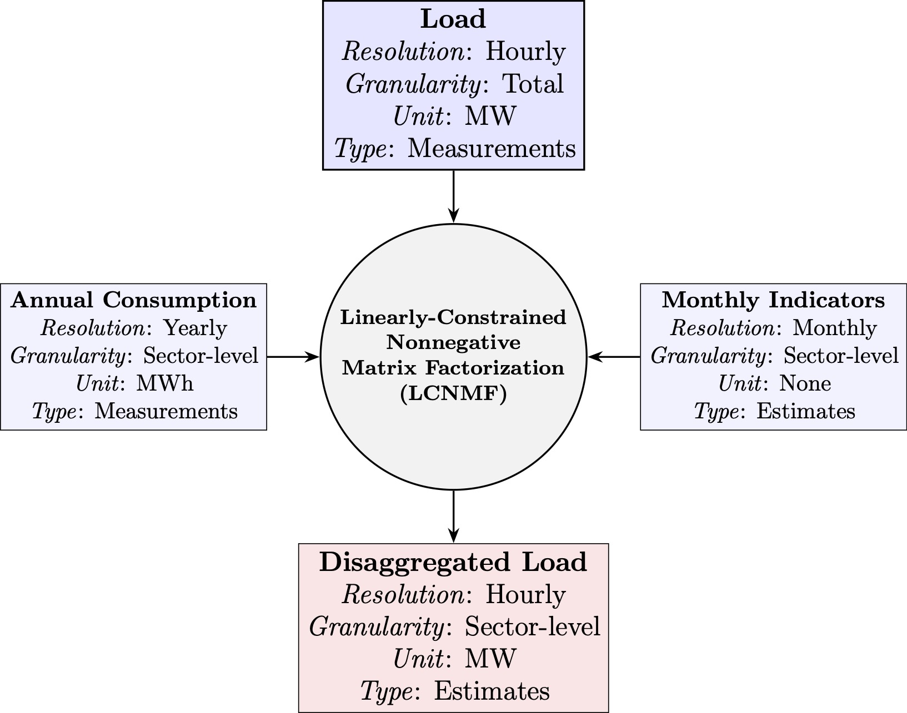

# load-bss

<p align="center">
  
</p>

This repository contains the code associated with the following paper:

> Koechlin, G., Bovera, F., Degli Innocenti, E., Santini B., Venturi A., Vazio, S., & Secchi, P. (2025). **A Blind Source Separation Framework to Monitor Sectoral Power Demand from Grid-Scale Load Measurements**. _arXiv preprint_. [`doi.org/10.48550/arXiv.2512.15232`](https://doi.org/10.48550/arXiv.2512.15232)

## Set-up
### Create Python virtual environment
Run the following command in your terminal:
```{bash}
python3 -m venv load_bss
```
This creates a virtual environment named `load_bss` in the current directory.

### Activate virtual environment
```{bash}
source load_bss/bin/activate
```
Once activated, your terminal prompt will indicate that the virtual environment is active (e.g., it might look like `(load_bss)`)

### Install packages from `requirements.txt`
```{bash}
pip install -r requirements.txt
```
This installs all the packages listed in `requirements.txt` into the virtual environment.

## Data collection

### Hourly load measurements
Run Python script `load_data_ingestion.py`

### Monthly sector indicators (MSI)
- **Enel**: Provided by Terna
- **IMCEI**: Excel file to be downloaded from dashboard at [dati.terna.it/en/load/imcei#imcei-vs-ipi](https://dati.terna.it/en/load/imcei#imcei-vs-ipi)
- **IMSER**: Provided by Terna

### Annual sector consumption (ASC)
Excel file manually built from statistical reports "Consumi 20XX" available at [terna.it/it/sistema-elettrico/statistiche/pubblicazioni-statistiche](https://www.terna.it/it/sistema-elettrico/statistiche/pubblicazioni-statistiche.)

## Data preprocessing & parameters setting
1. Run Python script `load_preprocessing.py` to get daily load curves in functional form from raw load data

2. Run R script `FDA.R` to perform the functional data analysis (smoothing and functional principal component analysis)
3. Use jupyter notebook `search_lcnmf_hyperparams.ipynb` to set $\alpha$ and $\beta$ hyperparameters to suitable values

## Blind source separation

### Perform the $N$ Monte-Carlo simulations of the LCNMF 
Run Python script `blind_separation.py` from terminal:
```{bash}
python3 blind_separation.py --n_comp 5 --alpha 3e-10 --beta 1 --n_runs 1000 --infile daily_curves.csv --outfile lcnmf_results.npz
```

### Post-process and analyse MC results
Run notebook `blind_separation_postprocessing.ipynb`

### Decompose load in sectors contributions
Run notebook `load_decomposition_analysis.ipynb` to decompose load from the ensemble of LCNMF models fitted, resulting from the MC simulations. It also contains the analysis of the load profiles per sector.

It is also possible to directly estimate the monthly consumption per sector from new load data (preprocessed as described previously, and composed of entire months) by running the Python script `decompose_load.py` from the terminal:

```{bash}
python3 decompose_load.py --infile_load daily_curves_new.csv --infile_models lcnmf_ens.pkl --outfile sectors_monthly_consumption_new.csv
```
The output file contains the estimation of each single LCNMF model (resulting from the MC simulations) from which any summary statistic can be derived (mean, median, prediction interval, ...etc.)


